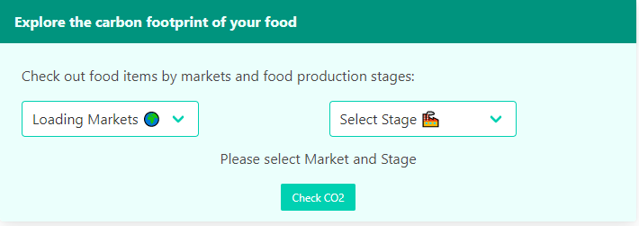
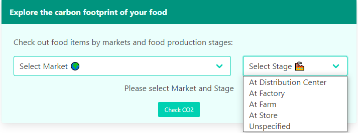

#  GA London React Project-2-What's My Footprint

## TABLE OF CONTENTS

- [Overview](#overview)
  - [Brief](#brief)
  - [Technologies Used](#technologies)
  - [Installation](#installation)
- [Development](#development)
  - [Dropdowns](#dropdowns)
    - [Get Countries Demo](#country-demo)
    - [Get Countries Code Snippet](#country-code)
    - [Stages Dropdown](#stages-dropdown)
- [Search Request](#search)
    - [Search Demo](#search-demo)
    - [Form](#form)
    - [Search Results](#results)
    - [Farm Search Results](#farm-results)
    - [Other Stages Search Results](#other-results)
  - [Styling](#styling)
- [Difficulties](#difficulties)
  - [Known bugs](#bugs)
  - [Challenges](#challenges)
- [Future Improvements](#improvements)
- [Key Learnings](#learnings)

## <a name='overview'>Overview</a>

The second project for General Assembley (GA) Software Engineering Immersive(SEI-Flex) program was to build a React application that consumes a public API.

We have selected [Carbon Cloud API](https://carboncloud.com/climate-footprint-api/) to get products Carbon dioxide equivalent (CO2e). Our application aims to allow users to:
- Display products from various Markets based on the selected production Stage.
- Search for products by name from the rendered list.
- Show Most and Least emissive products from selected categories.
- Add selected products to "Interested In" or "Would like to Avoid" baskets
- Estimate the total impact of products in the baskets.

The app can be viewed [here](https://whatsmyfootprint.netlify.app/).

### <a name='brief'>Brief</a>

The app had to:

* Consume a public API – this could be anything but it must make sense for your project.
* The app should include a router - with several "pages".
* Include wireframes - that you designed before building the app.
* Have semantically clean HTML.
* Be deployed online and accessible to the public.

### <a name='technologies'>Technologies Used</a>

* JavaScript
* React
* React-router-dom
* Bulma
* VSCode
* Git/GitHub
* Insomnia/Postman
* @nivo/bar
* @nivo/pie
* iso-3166-1

### <a name='installation'>Installation</a>

* Clone the repo
* [Request personal Carbon Cloud Api key or use public key for private use.](https://developers.carboncloud.com/)
* Install all frontend packages (from package.json) by running `npm install`
* Start server with `npm run start`

## <a name='development'>Development</a>

### <a name='dropdowns'>Dropdowns</a>

#### <a name='country-demo'>Get Countries Demo</a>




#### <a name='country-code'>Get Countries Code Snippet</a>
```
function iso3SortedList(arr){
    const countries = arr.map(item=>{
        const {country:countryName,alpha3:countryCode} = iso.whereAlpha3(item.key)
        return {countryName,countryCode}
    })
    return countries.sort((current,next)=>current.countryName.localeCompare(next.countryName))
}

const [dropdownList,setDropdownList] = useState(undefined);
    
    useEffect(()=>{
        async function getCountriesNames(){
            const response = await fetch('https://api.carboncloud.com/v0/search', {
                headers: {
                Accept: 'application/json',
                "X-API-KEY" : process.env.REACT_API_KEY,
                },
                })
            const data = await response.json()
            const buckets =data.aggregations.Markets.Markets.buckets
            setDropdownList(iso3SortedList(buckets))
        }
        getCountriesNames()
    }
    ,[])
```
API returns deeply nested ISO3 code of available countries from the initial search which will be used to generate future queries for products. To use it for dropdown we have used `iso-3166-1` library to get full names of the countries. We have also made a sorting function `iso3SortedList(arr)` to clean up the code and make it more reusable.


#### <a name='stages-dropdown'>Stages Dropdown</a>


```
const stages = {
    DistributionCenter: "At Distribution Center",
    Factory:"At Factory",
    Farm:"At Farm",
    StoreShelf:"At Store",
    NoSpecific:"Unspecified"
}

<div className="select is-primary">
            <select onChange={(e)=>{setStageOption(e.target.value)}}>
                <option hidden>Select Stage &#127981;</option>
                {Object.entries(stages).map((stage,i)=>{
                    return <option key={i} value={stage[0]}>{stage[1]}</option>
                })}
            </select>
        </div>
```
Stages object is imported from reusable forlder to generate currently available stages. This information is not accessible by API call hence had to be hardcoded. 


### <a name='search'>Search Request</a>

#### <a name='search-demo'>Search Demo</a>


#### <a name='form'>Form</a>

```
return <div className="content">
    <p>{prompt}</p>
    <div className="columns has-text-primary-dark">
        <div className="column"><CountryDropdown setMarketCode={setMarketCode}/></div>
        <div className="column"><StageDropdown setStageOption={setStageOption}/></div>
    </div>

```
Renders Market and Stage dropdowns.

```
    function displayError(){
        const text = "Please select"
        if(!marketCode&&!stageOption){return <p>{text} Market and Stage</p>} 
        else if(!marketCode){return <p>{text} Market</p>}
        else if(!stageOption){return <p>{text} Stage </p>}
        else return ""
    }

```
`displayError` function returns a paragraph or empty string. Apart from displaying missing information for submission it also used as validator within `handleSubmitForm`.

```
function handleSubmitForm(e){
    e.preventDefault()
    if(displayError()){return}
    navigate(`/search/market=${marketCode}&stage=${stageOption}`, {state:{market:marketCode,stage:stageOption}});
    }

    ...

    <div className="columns is-centered">
    <div className="control has-text-centered">
        {displayError()}
        <button onClick={(e)=>{handleSubmitForm(e)}} className=" button is-primary is-small">Check CO2</button>
    </div>

```

`handleSubmitForm` checks if `displayError` returns truthy value indicating that there are parameters missing to return early.
if falsy value is returned - form will be "submitted" and navigation to path with <SearchResults /> will triggered.


#### <a name='results'>Search Results</a>

```
    <Route path={`/search/market=:market&stage=:stage`} element={
    <BasketContext.Provider value={[interestedInArr,setInterestedInArr,wantToAvoidArr,setWantToAvoidArr]}>
        <SearchResults/>
    </BasketContext.Provider>
    } />
```

useContext is used to pass currently selected items to the `<SearchResults/>` element and its children from `<App/>`

```
    market = useLocation().state.market
    stage = useLocation().state.stage

```
set market and stage from form submission

```
    if(!market){
        market = useParams().market
    }
    if(!stage){
        stage = useParams().stage
    }

```
if no data has been provided via form, take `:market` and `stage` parameters from url.
!This works only in development and crashes in production. It will be discussed in bugs section.

```
const stages = ["DistributionCenter","Factory","StoreShelf","NoSpecific"]
    if(stage==="Farm"){
        return <FarmResults market={market} stage={stage} />
    } else if(stages.includes(stage)){
        return <DisCenterFactoryStoreUnspecifiedResults market={market} stage={stage} />
    }
```
Renders Farm or Other stages depending on selected stage
#### <a name='farm-results'>Farm Search Results</a>
#### <a name='other-results'>Other Stages Search Results</a>


